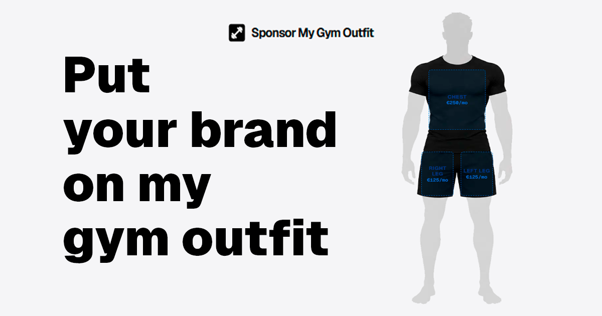

<div align="center">

# Sponsor My Gym Outfit



**A sponsorship platform where brands can book logo placements on gym's outfit, built with Next.js and Vanilla CSS.**

[Live demo](https://sponsormygymoutfit.com)

</div>

## 📖 Description

This project is a single-page sponsorship platform inspired by [sponsormymac.com](https://sponsormymac.com).

It allows brands, startups, and creators to purchase physical ad spots on Marc's gym apparel, worn 4 times a week at Aqua Sport Clubs in Vilanova i la Geltrú (near Barcelona). The site features an interactive outfit viewer, a booking modal with logo upload, automated email delivery via Resend, and Stripe checkout integration.

## 🎯 Features

- An interactive front/back outfit viewer with clickable sponsorship zones.
- Real-time analytics badge showing live visitors and total visits via DataFast.
- A booking modal with brand info form and drag-and-drop logo upload.
- Automated email delivery of booking details and logo attachment via Resend.
- Stripe Payment Links integration for monthly recurring checkout.
- A post-checkout success confirmation modal.
- A photo gallery with lightbox interaction.
- FAQ accordion and legal modals (Terms and Privacy Policy).
- Responsive design.

## 🛠️ Built With

- [Next.js](https://nextjs.org/)
- [Yet Another React Lightbox](https://yet-another-react-lightbox.com/)
- [Lucide React](https://lucide.dev/)
- [Stripe](https://stripe.com/)
- [Resend](https://resend.com/)
- [DataFast](https://datafa.st/)
- [Vercel](https://vercel.com/)

## ⚙️ Setup Guide

You will need `node.js` and `git` installed globally on your machine.

1. Clone the repository:

   ```bash
   git clone https://github.com/leknod/sponsor-my-gym-outfit.git
   ```

2. Install dependencies:

   ```bash
   cd sponsor-my-gym-outfit
   npm install
   ```

3. Run the development server:

   ```bash
   npm run dev
   ```

Open http://localhost:3000 to view it in the browser.

---

<div align="center">

[MIT License](https://github.com/leknod/sponsor-my-gym-outfit/blob/main/LICENSE) | [MarcDoncel.com](https://marcdoncel.com)

</div>
